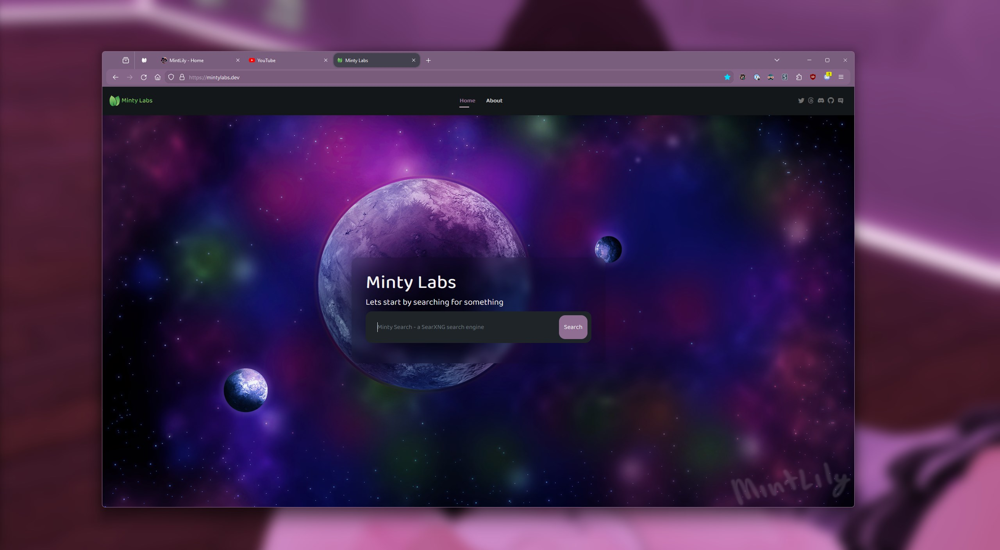

This theme is my spin on [harshpx](https://github.com/harshpx)'s [TealFox](https://github.com/harshpx/TealFox) theme, which is based on [migueravila](https://github.com/migueravila)'s [SimpleFox](https://github.com/migueravila/SimpleFox) theme. 
Using [Dark Vanilla](https://github.com/MintLily/Dark-Vanilla)'s color palette, with some added Material3 Web design choices. (pretty much just the rounded corners)

 

 

## Installation/Setup
1. Go to `about:config` and Set these flags **true**:
    - **`toolkit.legacyUserProfileCustomizations.stylesheets`**
    - **`layers.acceleration.force-enabled`**
    - **`gfx.webrender.all`**
    - **`svg.context-properties.content.enabled`**
2. Go to your Firefox profile:
   1. Go to the "URL" `about:profiles`
   2. In the section marked: "This is the profile in use and it cannot be deleted.", press the "Open Folder" button for the **Root Directory**
    - Linux: `$HOME/.mozilla/firefox/XXXXXXX.default-release/`
    - Windows: `C:\Users\<USERNAME>\AppData\Roaming\Mozilla\Firefox\Profiles\XXXXXXX.default-XXXXXX`
    - MacOS: `Users/<USERNAME>/Library/Application Support/Firefox/Profiles/XXXXXXX.default-XXXXXXX` 
3. Create an folder named `chrome` into this directory (if it does not already exists).
4. Copy all the repo contents into `chrome` folder.
    - Or just the `userChrome.css` file in to the `chrome` folder
    - And/Or right-click, Save File As, save into the `chrome` folder
5. Make all the customizations you want.
6. Enjoy!
